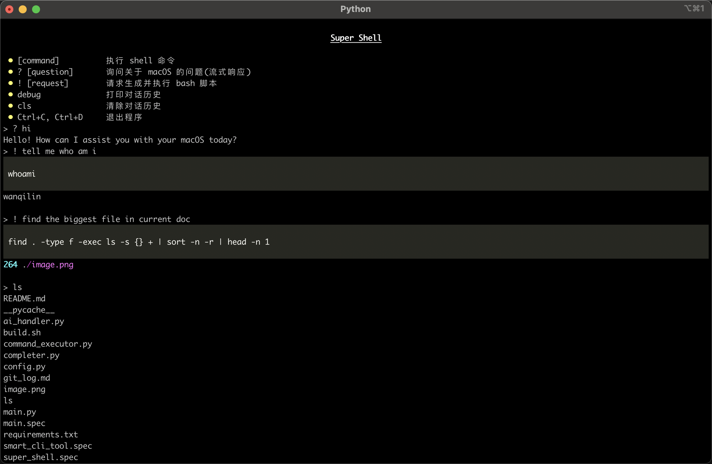
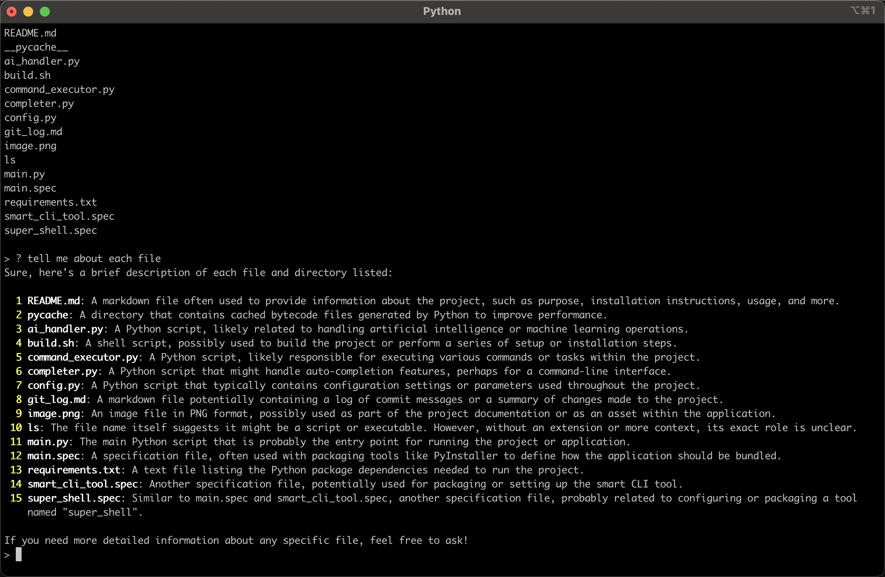

# SmartCLI

SmartCLI is an intelligent Command Line Interface (CLI) tool that uses AI to process natural language commands and execute corresponding system operations.




## Features

- Natural language processing for command execution
- Command auto-completion
- Custom commands implementation


## File Structure

- `ai_handler.py`: Interacts with the AI model to process natural language input.
- `command_executor.py`: Executes system commands.
- `completer.py`: Provides command completion functionality.
- `config.py`: Contains project configuration.
- `main.py`: Main entry point to initialize and run the CLI tool.
- `requirements.txt`: Lists project dependencies.
- `test_openai.py`: Tests OpenAI interactions.

## Installation

1. Clone the repository:

    ```bash
    git clone https://github.com/ssochi/SmartCLI.git
    cd SmartCLI
    ```

2. Install the dependencies:

    ```bash
    pip install -r requirements.txt
    ```

## Usage

1. Run the CLI tool:

    ```bash
    python main.py
    ```

2. Enter natural language commands in the CLI, e.g., "List all files in the current directory."

## Testing

Run the test script:

```bash
python test_openai.py
```

## Configuration

Modify the `config.py` file to change settings, including API keys and default configurations.

## Contributing

1. Fork the repository.
2. Create a new branch.
3. Make your changes and commit them.
4. Open a Pull Request.

## License

This project is licensed under the MIT License.

---

Feel free to adjust the content based on additional project details or specific needs.